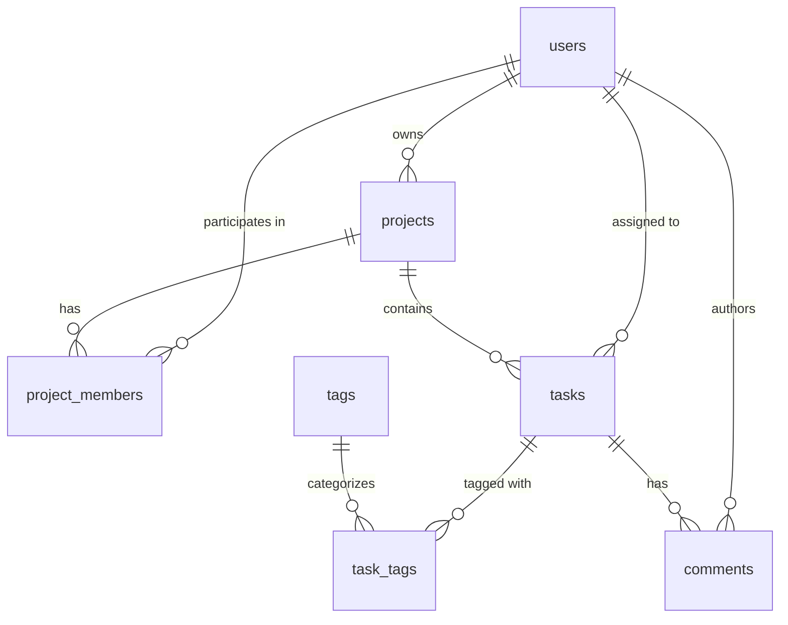

# CMIT Internship Program — Week 6: Assignment 1
## Task Management Domain — TypeORM Entities & Migrations

A production-grade relational database schema for a Task Management platform built with **TypeScript**, **TypeORM**, and **PostgreSQL**. This project rebuilds the database domain using TypeORM entities, relations, composite keys, database-level constraints, and committed migrations with `synchronize: false`.

---

## 📋 Overview & Domain Model

The domain models a multi-user task management workspace across **7 relational tables**:



### Table Schema & Constraints

| Table | Primary Key | Key Columns & Types | Constraints / Rules |
| :--- | :--- | :--- | :--- |
| **`users`** | `id` (Serial) | `name` (text), `email` (text), `created_at` (timestamp) | `email` is `UNIQUE NOT NULL` |
| **`projects`** | `id` (Serial) | `name` (text), `owner_id` (int), `created_at` (timestamp) | `owner_id` references `users(id)` (`ON DELETE RESTRICT`) |
| **`project_members`** | `(user_id, project_id)` (Composite PK) | `role` (enum: `owner`, `admin`, `member`, `viewer`) | Enforces "one role per user per project", cascades on delete |
| **`tasks`** | `id` (Serial) | `title` (text), `description` (text, null), `status` (enum: `todo`, `in_progress`, `done`), `priority` (int, 1–5), `project_id` (int), `assignee_id` (int, null), `due_date` (date, null), `created_at` (timestamp) | `tasks_priority_check` (`CHECK (priority BETWEEN 1 AND 5)`), cascades on project delete, sets null on assignee delete |
| **`tags`** | `id` (Serial) | `name` (text) | `name` is `UNIQUE NOT NULL` |
| **`task_tags`** | `(task_id, tag_id)` (Composite PK) | `task_id` (int), `tag_id` (int) | Many-to-Many join table with cascading foreign keys |
| **`comments`** | `id` (Serial) | `task_id` (int), `author_id` (int), `body` (text), `created_at` (timestamp) | `task_id` references `tasks(id)` (`CASCADE`), `author_id` references `users(id)` (`RESTRICT`) |

---

## 🛠️ Tech Stack

- **Runtime:** Node.js
- **Language:** TypeScript (`ES2022`, strict mode)
- **ORM:** TypeORM `0.3.x`
- **Database Driver:** `pg` (PostgreSQL)
- **Configuration:** `dotenv`

---

## 📁 Project Structure

```text
Assignment1/
├── src/
│   ├── data-source.ts                  # TypeORM DataSource initialization (.env config)
│   ├── entities/
│   │   ├── Comment.ts                  # Comment entity definition
│   │   ├── enums.ts                    # ProjectRole & TaskStatus enum definitions
│   │   ├── Project.ts                  # Project entity definition
│   │   ├── ProjectMember.ts            # Composite PK ProjectMember entity definition
│   │   ├── Tag.ts                      # Tag entity definition
│   │   ├── Task.ts                     # Task entity with checks, relations & join table
│   │   └── User.ts                     # User entity definition
│   └── migrations/
│       └── 1787556886187-InitialSchema.ts # Committed migration (up & down)
├── .env.example                        # Template for database connection environment variables
├── .gitignore                          # Ignored files (node_modules, dist, .env, logs)
├── package.json                        # Dependencies and migration scripts
├── tsconfig.json                       # TypeScript compiler options
└── README.md                           # Documentation
```

---

## 🚀 Getting Started

### Prerequisites
- [Node.js](https://nodejs.org/) (v18+ recommended)
- [PostgreSQL](https://www.postgresql.org/) database server

### 1. Installation
Clone the repository and install dependencies:
```bash
npm install
```

### 2. Environment Configuration
Create a `.env` file from the example template:
```bash
cp .env.example .env
```
Update `.env` with your PostgreSQL database credentials:
```env
DB_HOST=localhost
DB_PORT=5432
DB_USERNAME=your_db_user
DB_PASSWORD=your_db_password
DB_DATABASE=your_db_name
```

### 3. Build & Typecheck
Ensure all TypeScript definitions compile without errors:
```bash
npm run build
```

---

## 🗄️ Database Migrations

In accordance with production safety best practices, **`synchronize: false`** is strictly enforced. All schema changes are applied through versioned migrations.

### Run Migrations (`up`)
Applies pending migrations to the database and builds the 7-table schema, custom enum types, composite keys, and foreign key constraints:
```bash
npm run migration:run
```

### Revert Migrations (`down`)
Rolls back the latest migration, cleanly dropping foreign keys, indexes, tables, and enums in safe reverse order:
```bash
npm run migration:revert
```

### Generate a New Migration
If entities are modified, generate a new migration file:
```bash
npm run migration:generate -- src/migrations/YourMigrationName
```

---

## 🔒 Key Design Decisions

1. **Explicit Migrations over Auto-Synchronization:** `synchronize: false` ensures zero accidental data destruction in development and production environments.
2. **Environment Isolation:** Database credentials are never hardcoded and are loaded strictly at runtime through `process.env`.
3. **Composite Primary Keys:** `ProjectMember` and `task_tags` use composite keys (`(user_id, project_id)` and `(task_id, tag_id)`) rather than surrogate IDs to guarantee relational integrity at the schema level.
4. **Single-Sided Many-to-Many Declaration:** `@JoinTable` is placed solely on `Task.tags` to avoid duplicating join tables in PostgreSQL.
5. **Database-Level Integrity:** Enum constraints and priority range bounds (`CHECK (priority BETWEEN 1 AND 5)`) are enforced directly inside PostgreSQL.


# X3 Task
PR description — 3–5 lines

This migration makes tasks.description non-nullable using ALTER COLUMN SET NOT NULL.
It is unsafe if any existing task has a NULL description because PostgreSQL will reject the migration.
Before running it, existing NULL descriptions should be updated with an appropriate value.
After the data is cleaned, the constraint can be applied without deleting existing rows.