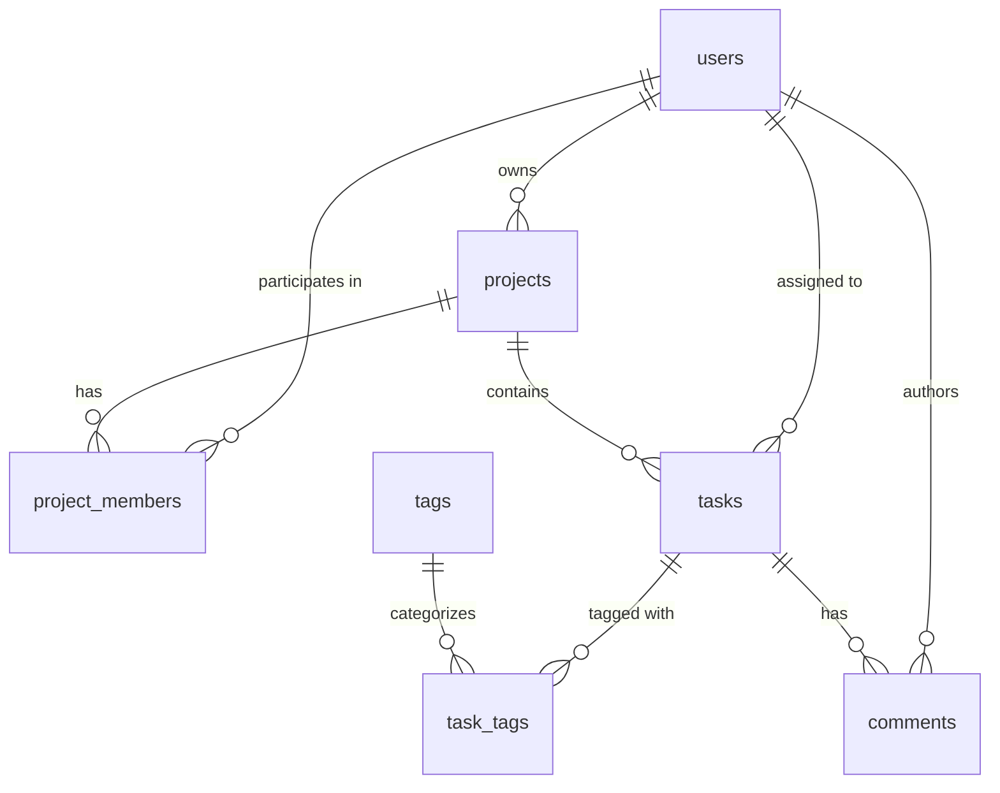

# CMIT Internship Program — Week 6: Assignment 2
## Task Management Domain — Seed & Typed Repository Queries

A production-grade relational database and typed data layer for a Task Management platform built with **TypeScript**, **TypeORM**, and **PostgreSQL**. 

This project implements:
- Rebuilt Week 5 database schema using TypeORM entity classes and committed migrations (`synchronize: false`).
- **Idempotent & Transaction-Wrapped Seeding** (`seed.ts`) meeting all minimum data volumes and edge cases.
- **Strongly-Typed Repository & QueryBuilder Functions** (`queries.ts`) implementing queries **Q1 through Q10** with 100% strict TypeScript types and zero `any` annotations.
- A query runner script (`run-queries.ts`) to execute and verify all queries against the database.

---

## 📋 Domain Model & Entity Schema

The domain models a multi-user task management workspace across **7 relational tables**:



### Table Schema & Constraints

| Table | Primary Key | Key Columns & Types | Constraints / Rules |
| :--- | :--- | :--- | :--- |
| **`users`** | `id` (Serial PK) | `name` (text), `email` (text), `created_at` (timestamp) | `email` is `UNIQUE NOT NULL` |
| **`projects`** | `id` (Serial PK) | `name` (text), `owner_id` (int), `created_at` (timestamp) | `owner_id` references `users(id)` (`ON DELETE RESTRICT`) |
| **`project_members`** | `(user_id, project_id)` (Composite PK) | `role` (enum: `owner`, `admin`, `member`, `viewer`) | Enforces "one role per user per project", cascades on delete |
| **`tasks`** | `id` (Serial PK) | `title` (text), `description` (text), `status` (enum: `todo`, `in_progress`, `done`), `priority` (int, 1–5), `project_id` (int), `assignee_id` (int, null), `due_date` (date, null), `created_at` (timestamp) | `tasks_priority_check` (`CHECK (priority BETWEEN 1 AND 5)`), `tasks_status_check`, cascades on project delete, sets null on assignee delete |
| **`tags`** | `id` (Serial PK) | `name` (text) | `name` is `UNIQUE NOT NULL` |
| **`task_tags`** | `(task_id, tag_id)` (Composite PK) | `task_id` (int), `tag_id` (int) | Many-to-Many join table with cascading foreign keys |
| **`comments`** | `id` (Serial PK) | `task_id` (int), `author_id` (int), `body` (text), `created_at` (timestamp) | `task_id` references `tasks(id)` (`CASCADE`), `author_id` references `users(id)` (`RESTRICT`) |

---

## 📁 Project Structure

```text
Assignment2/
├── src/
│   ├── data-source.ts                  # TypeORM DataSource configuration (synchronize: false)
│   ├── seed.ts                         # W1/X2/X3: Idempotent, transaction-wrapped database seed
│   ├── queries.ts                      # W2/C1-C4/X1: Typed queries Q1–Q10 using QueryBuilder
│   ├── run-queries.ts                  # Query execution script to test and display results
│   ├── entities/
│   │   ├── Comment.ts                  # Comment entity definition
│   │   ├── enums.ts                    # ProjectRole & TaskStatus enum definitions
│   │   ├── Project.ts                  # Project entity definition
│   │   ├── ProjectMember.ts            # Composite PK ProjectMember entity definition
│   │   ├── Tag.ts                      # Tag entity definition
│   │   ├── Task.ts                     # Task entity with checks, indexes, relations & join table
│   │   └── User.ts                     # User entity definition
│   └── migrations/
│       ├── 1787656797093-InitialSchema.ts          # Initial 7-table schema migration
│       ├── 1787664050166-AddTaskIndexes.ts         # Performance indexes migration
│       └── 1787807138183-MakeTaskDescriptionRequired.ts # Non-nullable description migration
├── .env.example                        # Template for database connection environment variables
├── .gitignore                          # Git ignore configuration
├── package.json                        # Scripts and dependencies
├── tsconfig.json                       # TypeScript compiler configuration (strict mode)
└── README.md                           # Project documentation
```

---

## 🚀 Getting Started

### 1. Prerequisites
- **Node.js:** v18+ (Node 20+ recommended)
- **PostgreSQL:** Running PostgreSQL database instance

### 2. Installation
```bash
npm install
```

### 3. Environment Setup
Create a `.env` file from the `.env.example` template:
```bash
cp .env.example .env
```

Configure your PostgreSQL credentials in `.env`:
```env
DB_HOST=localhost
DB_PORT=5432
DB_USERNAME=your_postgres_username
DB_PASSWORD=your_postgres_password
DB_DATABASE=your_database_name
```

### 4. Run Migrations
Build the schema on an empty database:
```bash
npm run migration:run
```

---

## 🌱 Database Seeding (`src/seed.ts`)

Run the seed script to populate initial test data:
```bash
npm run seed
```

### Seeding Features & Validation:
- **Minimum Data Volumes:**
  - 6 Users
  - 3 Projects
  - 7 Project Memberships (covering `owner`, `admin`, `member`, `viewer` roles)
  - 6 Tags
  - 15 Tasks
  - 20 Task-Tag relationships
  - 10 Comments
- **Special Edge Cases Included:**
  1. At least one task with no assignee (`Write setup guide`, `assigneeId: null`).
  2. Overdue tasks past due date that are not done (Tasks with past due dates and `todo` or `in_progress` status).
  3. One project with zero tasks (`Future Project`).
  4. One user with zero assigned tasks (`Fatima Raza`).
- **Challenge X2 (Idempotency):**
  Uses find-or-create logic on natural keys (`email`, `name`, composite IDs, etc.) with sequential `.reduce()` execution. Running `npm run seed` multiple times leaves the database in the exact same state without unique constraint errors.
- **Challenge X3 (Transaction Safety):**
  Wrapped entirely inside `AppDataSource.transaction(async (manager) => { ... })` so that a failure halfway through triggers a full rollback and leaves the database untouched.

---

## 🔍 Typed Queries (`src/queries.ts`)

Execute all queries and view formatted output:
```bash
npm run queries
```

### Summary of Implemented Queries:

| Problem | Query | Function Signature | Description |
| :--- | :---: | :--- | :--- |
| **W2** | **Q1** | `getTasksByProject(projectId: number): Promise<Task[]>` | Returns tasks for a project ordered by due date ascending with `NULLS LAST`. |
| **C1** | **Q2** | `countTasksByStatus(): Promise<TaskStatusCount[]>` | Aggregates and counts tasks per status using `QueryBuilder`, converting count to runtime numbers. |
| **C2** | **Q3** | `getUsersWithTaskCounts(): Promise<UserTaskCount[]>` | Uses `LEFT JOIN` so users with 0 tasks (e.g., Fatima) appear with `taskCount: 0`. |
| **C3** | **Q4** | `getTasksByTag(tagName: string): Promise<Task[]>` | Reads tasks carrying a specific tag using bound parameter `:tagName`. |
| **C3** | **Q5** | `getOverdueTasks(): Promise<Task[]>` | Filters for overdue, non-done tasks with the eager `assignee` relation loaded. |
| **C4** | **Q6** | `getTopUsersByCompleted(limit: number): Promise<UserCompletedCount[]>` | Filters `status = 'done'` before grouping, ordered descending by done count. |
| **X1** | **Q7** | `getProjectsWithoutTasks(): Promise<Project[]>` | Searches for absence using a subquery with `NOT EXISTS`. |
| **X1** | **Q8** | `getAverageTagsPerTask(): Promise<AverageTagsPerTask>` | Calculates tags per task with a `LEFT JOIN` so tasks with 0 tags are counted in the average. |
| **X1** | **Q9** | `getCommentsPerTask(): Promise<TaskCommentCount[]>` | Groups comments per task ordered descending, including 0-comment tasks. |
| **X1** | **Q10** | `getProjectsWithMembers(): Promise<ProjectMemberRole[]>` | Lists all projects along with their assigned members and role enums. |

---

## 🛡️ Type Safety & Strict Verification

Type check the entire codebase with zero errors:
```bash
npm run typecheck
```

- **Strict Mode Enabled:** `"strict": true` configured in `tsconfig.json`.
- **Zero `any` Annotations:** All query return shapes and raw query results are strictly typed with declared interfaces (`RawTaskStatusCount`, `RawUserTaskCount`, `RawUserCompletedCount`, `RawAverageTagsPerTask`, `RawTaskCommentCount`, `RawProjectMemberRole`).
- **PostgreSQL Aggregate Casting:** String numbers from Postgres raw aggregates are explicitly mapped to JavaScript `number` types at runtime.

---

## 📜 Available NPM Scripts

| Script | Command | Description |
| :--- | :--- | :--- |
| `npm run typecheck` | `tsc --noEmit` | Runs strict TypeScript compiler typecheck. |
| `npm run build` | `tsc` | Compiles TypeScript source to `dist/`. |
| `npm run migration:run` | `typeorm-ts-node-commonjs migration:run` | Applies pending migrations to the database. |
| `npm run migration:revert`| `typeorm-ts-node-commonjs migration:revert` | Rolls back the latest applied migration. |
| `npm run seed` | `ts-node src/seed.ts` | Runs the idempotent, transaction-wrapped database seed. |
| `npm run queries` | `ts-node src/run-queries.ts` | Runs and logs all typed query results (Q1–Q10). |